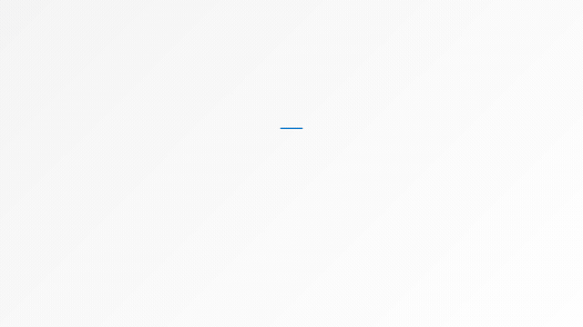
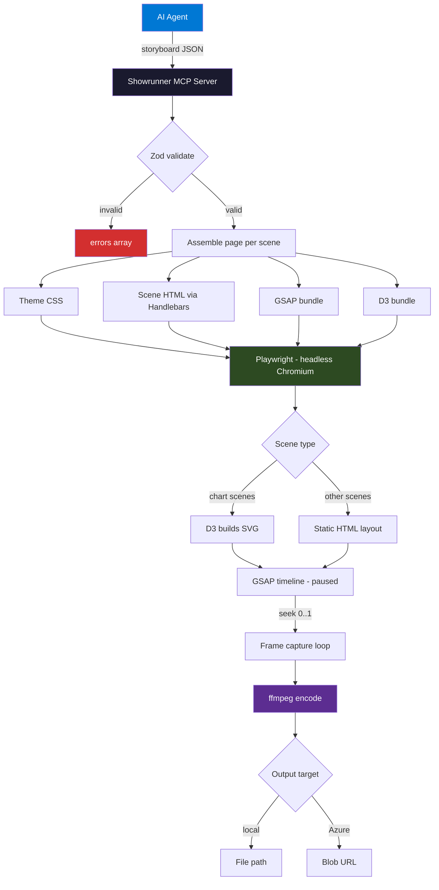
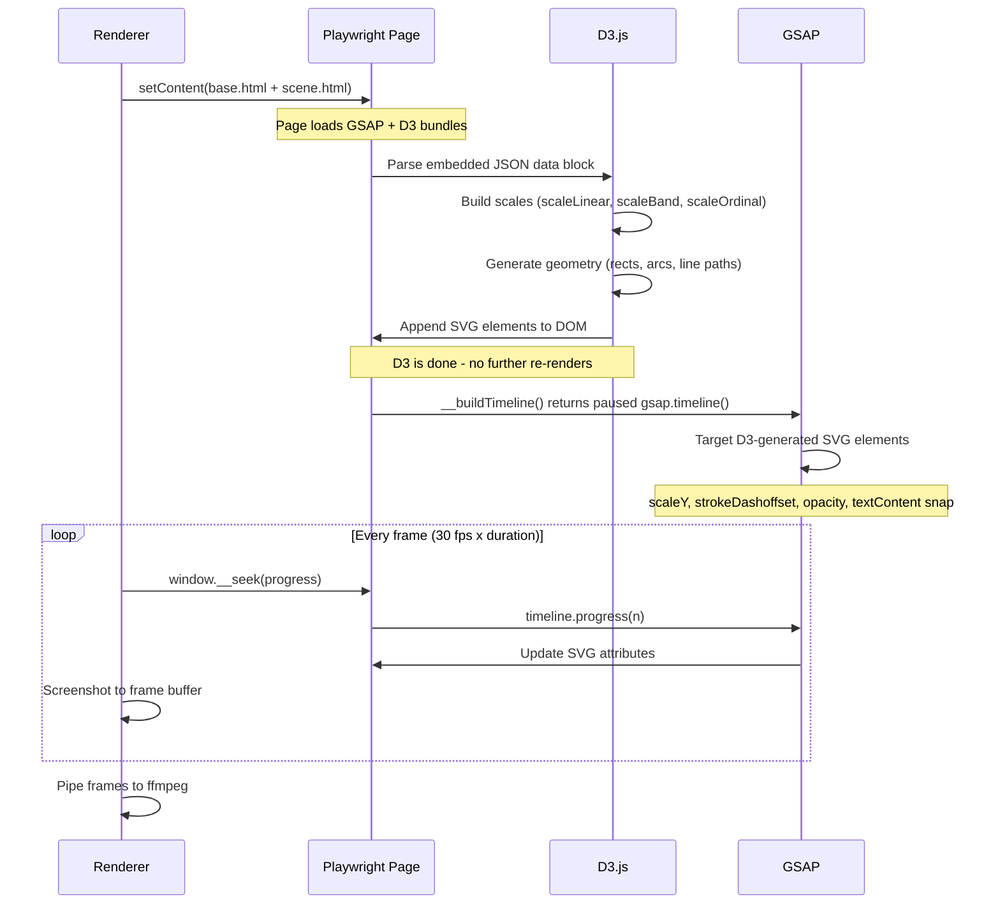
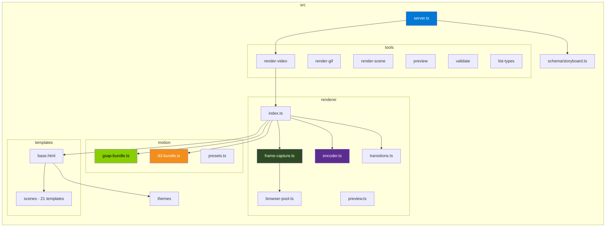

<div align="center">
  
  <h1>Showrunner</h1>
  <p><strong>Your AI crew's cinematographer.</strong> Send a storyboard JSON, get back an MP4 with spring-based motion, animated charts, and professional pacing.</p>
  <p>
    <code>MCP stdio</code> for local dev &nbsp;·&nbsp; <code>MCP HTTP</code> for Azure &nbsp;·&nbsp; same tools, same storyboard
  </p>
  <p>
    <a href="docs/scene-catalog.md"><strong>📖 Browse the Scene Catalog</strong></a> — animated GIF previews, data schemas, and sample JSON for every scene type
  </p>
  <br/>
  <a href="docs/assets/showrunner-showcase.mp4">
    
  </a>
  <br/>
  <sub>▶ Click for full video</sub>
</div>

---

No Remotion. No subscription. No framework lock-in. Just Playwright frames, GSAP timelines, D3 charts, and ffmpeg encoding.

## How It Works



Each scene template builds a paused GSAP timeline. Chart scenes (`chart-bar`, `chart-line`, `chart-donut`) use D3 to construct SVG elements (scales, axes, paths, arcs) then hand off to GSAP for animation. The renderer scrubs `.progress(0..1)` for every frame, screenshots, and encodes. Deterministic — same input always produces the same frames.

## Prerequisites

- **Node.js** ≥ 20
- **ffmpeg** on PATH
- **Playwright Chromium** (auto-installed on first run)

## Install

```bash
# Global install
npm install -g showrunner-mcp

# Or run directly via npx (no install needed)
npx showrunner-mcp --help
```

## Quick Start

### Use via npx (recommended)

```bash
# Render a storyboard to MP4
npx showrunner-mcp render storyboard.json

# Render with options
npx showrunner-mcp render storyboard.json --quality high --output output/final.mp4

# Render to GIF
npx showrunner-mcp render storyboard.json --gif

# Validate a storyboard without rendering
npx showrunner-mcp validate storyboard.json

# List available scene types
npx showrunner-mcp scenes
```

### Use from source

```bash
# Clone and install
git clone https://github.com/JinLee794/Showrunner.git
cd Showrunner
npm install

# Build
npm run build

# Render the demo storyboard
npx showrunner-mcp render fixtures/demo-storyboard.json
```

## Showrunner MCP Server

### stdio (local dev)

```bash
npx showrunner-mcp
```

Agent config (VS Code / Claude Desktop / any MCP client):

```json
{
  "mcpServers": {
    "showrunner": {
      "command": "npx",
      "args": ["-y", "showrunner-mcp"]
    }
  }
}
```

### HTTP (remote / Azure)

```bash
TRANSPORT=http PORT=8080 npx showrunner-mcp
```

Agent config:

```json
{
  "mcpServers": {
    "showrunner": {
      "url": "https://<your-host>/mcp",
      "transport": "http"
    }
  }
}
```

## Tools

| Tool | Description | Returns |
|---|---|---|
| `render_video` | Render a full storyboard to MP4 | `{ path, duration, frames, fileSize }` |
| `render_gif` | Render a storyboard to animated GIF with speed/size control | `{ path, duration, frames, fileSize }` |
| `render_scene` | Render a single scene to MP4/GIF | `{ path }` |
| `preview_storyboard` | Generate interactive HTML preview (no Playwright/ffmpeg) | `{ path }` |
| `validate_storyboard` | Dry-run validation with error reporting | `{ valid, errors?, summary? }` |
| `list_scene_types` | List all scene types with data schemas | `Array<{ type, description, dataSchema }>` |

## Scene Types

> **[See the full Scene Catalog →](docs/scene-catalog.md)** for animated GIF previews, detailed data schemas, and copy-paste sample JSON for every scene type.

| Type | Description |
|---|---|
| `title-card` | Full-screen branded intro with logo, title, subtitle |
| `section-header` | Transition slide between sections |
| `pipeline-funnel` | Horizontal bars with staggered spring animation + count-up values |
| `milestone-timeline` | Vertical timeline with status dots and owner labels |
| `risk-callout` | Cards with severity stripes and context text |
| `action-items` | Numbered checklist with priority indicators |
| `deal-team` | Avatar grid with role labels |
| `kpi-scorecard` | 2×2 / 3×2 KPI cards with count-up and trend arrows |
| `chart-bar` | Animated bar chart with staggered spring |
| `chart-line` | SVG path draw-on line chart |
| `chart-donut` | Clockwise-fill donut with center count-up |
| `table` | Animated row-by-row table |
| `quote-highlight` | Quote with word-by-word reveal and sentiment accent |
| `comparison` | Side-by-side comparison with alternating slide-in |
| `closing` | Branded outro with tagline and CTA |
| `code-terminal` | Typing terminal with prompt/output/success lines |
| `image-card` | Full-bleed image with caption overlay and Ken Burns effects |
| `bullet-list` | Animated bullet list with icons, sub-text, and highlights |
| `stat-counter` | Big count-up numbers with progress bars and change indicators |
| `text-reveal` | Cinematic text with typewriter, word-reveal, and highlight effects |

## Storyboard Schema

```json
{
  "title": "Q2 Pipeline Review",
  "theme": "corporate-dark",
  "fps": 30,
  "resolution": [1920, 1080],
  "scenes": [
    {
      "type": "title-card",
      "duration": 4,
      "transition": "fade",
      "data": {
        "title": "Q2 Pipeline Review",
        "subtitle": "Enterprise Accounts",
        "date": "April 2026"
      }
    },
    {
      "type": "kpi-scorecard",
      "duration": 6,
      "transition": "fade",
      "data": {
        "kpis": [
          { "label": "Pipeline", "value": 28400000, "unit": "$", "trend": "up", "animateCount": true },
          { "label": "Win Rate", "value": 34, "unit": "%", "trend": "up", "animateCount": true }
        ]
      }
    },
    {
      "type": "closing",
      "duration": 3,
      "transition": "fade",
      "data": { "tagline": "Generated by AI" }
    }
  ]
}
```

See [`fixtures/sample-storyboard.json`](fixtures/sample-storyboard.json) and [`fixtures/demo-storyboard.json`](fixtures/demo-storyboard.json) for full examples.

## Themes

| Theme | Description |
|---|---|
| `corporate-dark` | Dark navy, white text, gold accent (default) |
| `corporate-light` | White background, dark text, blue accent |
| `minimal` | Near-white, subtle grays |
| `microsoft` | Microsoft brand guidelines |
| `custom` | Uses `branding` overrides from storyboard |

## Transitions

Applied between consecutive scenes with a 0.5s overlap:

| Type | Effect |
|---|---|
| `cut` | Hard cut, no overlap |
| `fade` | Cross-fade (default) |
| `slide-left` | Outgoing slides left, incoming slides from right |
| `slide-up` | Outgoing slides up, incoming slides from below |
| `zoom` | Outgoing zooms + fades, incoming scales in |

## Render Quality

| Quality | Frame format | CRF | Best for |
|---|---|---|---|
| `high` | PNG | 18 | Final output |
| `medium` | JPEG 90% | 23 | Default / preview |
| `fast` | JPEG 70% | 28 | Iteration |

## Technology Stack

| Layer | Technology | Role |
|---|---|---|
| **Data visualization** | [D3.js](https://d3js.org/) v7 | SVG chart construction — scales, axes, bars, arcs, line paths |
| **Animation** | [GSAP](https://gsap.com/) v3 | Timeline-based motion — springs, staggers, easing, count-up |
| **Templating** | [Handlebars](https://handlebarsjs.com/) | Scene HTML generation from storyboard data |
| **Browser** | [Playwright](https://playwright.dev/) | Headless Chromium for deterministic frame capture |
| **Encoding** | [ffmpeg](https://ffmpeg.org/) | H.264 MP4 and GIF output |
| **Validation** | [Zod](https://zod.dev/) | Storyboard schema validation |
| **Server** | [MCP SDK](https://modelcontextprotocol.io/) | stdio + HTTP tool server for AI agents |

## Animation System

GSAP (GreenSock) drives all motion. Each scene template builds a paused `gsap.timeline()` with springs, staggers, easing, and count-up animations. The renderer calls `window.__seek(progress)` per frame — fully deterministic, no requestAnimationFrame, no timing jitter.

Key GSAP features used: `stagger`, `back.out` / `elastic.out` / `power3.out` easing, `snap: { textContent: 1 }` for count-up, nested timeline composition.

### D3 + GSAP: How Charts Work

Chart scenes use a **two-library pattern** — D3 for construction, GSAP for animation:



This separation keeps D3 doing what it's best at (data → geometry mapping) and GSAP doing what it's best at (timeline-scrubbed animation), with no runtime conflicts.

| Chart type | D3 handles | GSAP animates |
|---|---|---|
| `chart-bar` | x/y scales, axis ticks, bar rects | Staggered scaleY grow + value count-up |
| `chart-line` | Line generator, area fill, x/y axes | strokeDashoffset draw-on + dot pop-in |
| `chart-donut` | Arc generator, pie layout, slices | Clockwise stroke draw + center count-up |

## Project Structure



<details>
<summary>Flat file tree</summary>

```
src/
├── server.ts                # Showrunner MCP server — stdio + HTTP transports
├── tools/                   # MCP tool handlers
├── renderer/
│   ├── index.ts             # Main render pipeline
│   ├── frame-capture.ts     # Playwright frame loop
│   ├── encoder.ts           # ffmpeg encoding
│   ├── transitions.ts       # Scene transition compositing
│   ├── browser-pool.ts      # Warm browser management
│   └── preview.ts           # HTML preview generator
├── output/
│   ├── local.ts             # File path output
│   └── blob.ts              # Azure Blob Storage output
├── motion/
│   ├── gsap-bundle.ts       # GSAP core for page injection
│   ├── d3-bundle.ts         # D3.js for page injection (chart scenes)
│   └── presets.ts           # Reusable animation presets
├── templates/
│   ├── base.html            # Common layout with theme + GSAP + D3 injection
│   └── scenes/              # Per-scene-type HTML templates
├── themes/                  # CSS custom property theme files
├── schema/
│   └── storyboard.ts        # Zod schemas
└── types/
    └── index.ts
```

</details>

## Scripts

```bash
npm run build    # tsc + copy templates/themes to dist/
npm run dev      # tsc --watch
npm start        # node dist/server.js
npm test         # vitest
```

## Publishing

Packages are published automatically via GitHub Actions when you create a release.

```bash
# 1. Bump version
npm version patch   # or minor / major

# 2. Push the tag
git push --follow-tags

# 3. Create a GitHub Release from the tag — CI publishes to npm
```

**Setup:** Add an `NPM_TOKEN` secret to the repo (Settings → Secrets → Actions).

## License

MIT

---

<div align="center">
  <sub>Built with 🎬 by the Showrunner crew</sub>
</div>
