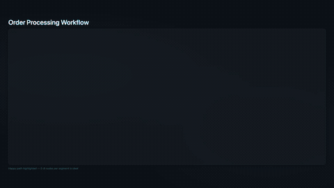

# Scene Type Catalog

> **Auto-generated** — do not edit manually. Run `npm run generate:catalog` to regenerate.

This catalog showcases every scene type available in Showrunner with animated previews, descriptions, and data schemas. Last updated: 2026-04-21.

## Table of Contents

- [Action Items](#action-items)
- [Bullet List](#bullet-list)
- [Chart Bar](#chart-bar)
- [Chart Donut](#chart-donut)
- [Chart Line](#chart-line)
- [Closing](#closing)
- [Code Diff](#code-diff)
- [Code Terminal](#code-terminal)
- [Code Terminal With Captions](#code-terminal-with-captions)
- [Comparison](#comparison)
- [Deal Team](#deal-team)
- [Image Card](#image-card)
- [Kpi Scorecard](#kpi-scorecard)
- [Logic Flow](#logic-flow)
- [Milestone Timeline](#milestone-timeline)
- [Pipeline Funnel](#pipeline-funnel)
- [Quote Highlight](#quote-highlight)
- [Risk Callout](#risk-callout)
- [Scene Showcase](#scene-showcase)
- [Section Header](#section-header)
- [Stat Counter](#stat-counter)
- [Table](#table)
- [Text Reveal](#text-reveal)
- [Title Card](#title-card)
- [Tool Call](#tool-call)

## Quick Reference

| Scene Type | Description |
|------------|-------------|
| [`action-items`](#action-items) | Numbered list. |
| [`bullet-list`](#bullet-list) | Animated bullet list with staggered entrance. |
| [`chart-bar`](#chart-bar) | Bars grow upward with staggered spring. |
| [`chart-donut`](#chart-donut) | Segments fill clockwise with easeInOut. |
| [`chart-line`](#chart-line) | Line draws left-to-right using path interpolation. |
| [`closing`](#closing) | Branded outro. |
| [`code-diff`](#code-diff) | Reviewer-first diff view with low-motion line reveals, semantic add/remove coloring, and optional callouts to orient attention before deep reading. |
| [`code-terminal`](#code-terminal) | Scene discovered from templates. |
| [`code-terminal-with-captions`](#code-terminal-with-captions) | Scene discovered from templates. |
| [`comparison`](#comparison) | Side-by-side comparison with center divider. |
| [`deal-team`](#deal-team) | Grid of avatar circles. |
| [`image-card`](#image-card) | Full-bleed image with optional caption overlay. |
| [`kpi-scorecard`](#kpi-scorecard) | Grid of KPI cards with count-up number animation and trend arrows. |
| [`logic-flow`](#logic-flow) | Animated flowchart / decision-tree diagram. |
| [`milestone-timeline`](#milestone-timeline) | Vertical timeline draws downward. |
| [`pipeline-funnel`](#pipeline-funnel) | Horizontal bars grow left-to-right with staggered spring easing. |
| [`quote-highlight`](#quote-highlight) | Quote text with attribution. |
| [`risk-callout`](#risk-callout) | Cards slide in from right with spring. |
| [`scene-showcase`](#scene-showcase) | Scene discovered from templates. |
| [`section-header`](#section-header) | Transition slide between sections. |
| [`stat-counter`](#stat-counter) | Big animated numbers that count up from 0. |
| [`table`](#table) | Data table with staggered row entrance. |
| [`text-reveal`](#text-reveal) | Cinematic text reveal scene. |
| [`title-card`](#title-card) | Full-screen branded intro. |
| [`tool-call`](#tool-call) | Animated tool/API call visualization. |

---

## Action Items

**Type:** `action-items`

Numbered list. Each item slides up with spring easing, staggered 100ms.


### Data Schema

| Field | Type | Required | Description |
|-------|------|----------|-------------|
| `items` | array | ✅ |  |

<details>
<summary>Sample JSON</summary>

```json
{
  "type": "action-items",
  "duration": 5,
  "data": {
    "items": [
      {
        "text": "Schedule executive sponsor meeting with CTO",
        "owner": "Sarah Chen",
        "due": "April 14",
        "priority": "high"
      },
      {
        "text": "Update pricing model for 3-year proposal",
        "owner": "James Wilson",
        "due": "April 12",
        "priority": "high"
      },
      {
        "text": "Complete technical validation for deployment",
        "owner": "Priya Patel",
        "due": "April 16",
        "priority": "normal"
      },
      {
        "text": "Prepare competitive displacement deck",
        "owner": "Marcus Johnson",
        "due": "April 18",
        "priority": "normal"
      }
    ]
  }
}
```

</details>

---

## Bullet List

**Type:** `bullet-list`

Animated bullet list with staggered entrance. Items slide in with spring easing. Supports icons, highlight borders, and sub-text. Respects animation.textEffect, animation.stagger, animation.direction overrides.


### Data Schema

| Field | Type | Required | Description |
|-------|------|----------|-------------|
| `title` | string |  |  |
| `subtitle` | string |  |  |
| `items` | array | ✅ |  |

<details>
<summary>Sample JSON</summary>

```json
{
  "type": "bullet-list",
  "duration": 5,
  "data": {
    "title": "Key Takeaways",
    "subtitle": "From this quarter's review",
    "items": [
      {
        "text": "Pipeline grew 18% quarter-over-quarter",
        "icon": "📈",
        "highlight": true
      },
      {
        "text": "Three new enterprise logos added",
        "icon": "🏢"
      },
      {
        "text": "Average deal size increased to $1.2M",
        "icon": "💰"
      },
      {
        "text": "Technical win rate improved by 5 points",
        "sub": "Up from 62% to 67%",
        "icon": "🎯"
      },
      {
        "text": "Two deals moved to negotiation stage",
        "sub": "Contoso and Fabrikam",
        "icon": "🤝"
      }
    ]
  }
}
```

</details>

---

## Chart Bar

**Type:** `chart-bar`

Bars grow upward with staggered spring. Values appear at bar tops.


### Data Schema

| Field | Type | Required | Description |
|-------|------|----------|-------------|
| `title` | string |  |  |
| `labels` | array | ✅ |  |
| `datasets` | array | ✅ |  |
| `annotation` | string |  |  |

<details>
<summary>Sample JSON</summary>

```json
{
  "type": "chart-bar",
  "duration": 5,
  "data": {
    "title": "Revenue by Region",
    "labels": [
      "Americas",
      "EMEA",
      "APAC",
      "LATAM"
    ],
    "datasets": [
      {
        "label": "Q1 Actual",
        "values": [
          12.4,
          8.7,
          6.2,
          3.1
        ]
      },
      {
        "label": "Q2 Forecast",
        "values": [
          14.1,
          9.3,
          7.8,
          4.2
        ]
      }
    ]
  }
}
```

</details>

---

## Chart Donut

**Type:** `chart-donut`

Segments fill clockwise with easeInOut. Center label counts up.


### Data Schema

| Field | Type | Required | Description |
|-------|------|----------|-------------|
| `title` | string |  |  |
| `labels` | array | ✅ |  |
| `datasets` | array | ✅ |  |
| `annotation` | string |  |  |

<details>
<summary>Sample JSON</summary>

```json
{
  "type": "chart-donut",
  "duration": 5,
  "data": {
    "title": "Deal Stage Distribution",
    "labels": [
      "Qualified",
      "Technical Win",
      "Proposal",
      "Negotiate",
      "Closed"
    ],
    "datasets": [
      {
        "label": "Deals",
        "values": [
          142,
          87,
          34,
          18,
          9
        ]
      }
    ]
  }
}
```

</details>

---

## Chart Line

**Type:** `chart-line`

Line draws left-to-right using path interpolation. Data points pop in.


### Data Schema

| Field | Type | Required | Description |
|-------|------|----------|-------------|
| `title` | string |  |  |
| `labels` | array | ✅ |  |
| `datasets` | array | ✅ |  |
| `annotation` | string |  |  |

<details>
<summary>Sample JSON</summary>

```json
{
  "type": "chart-line",
  "duration": 5,
  "data": {
    "title": "Monthly Pipeline Trend",
    "labels": [
      "Jan",
      "Feb",
      "Mar",
      "Apr",
      "May",
      "Jun"
    ],
    "datasets": [
      {
        "label": "Pipeline",
        "values": [
          28,
          32,
          35,
          38,
          42,
          45
        ]
      },
      {
        "label": "Target",
        "values": [
          30,
          33,
          36,
          39,
          42,
          45
        ]
      }
    ]
  }
}
```

</details>

---

## Closing

**Type:** `closing`

Branded outro. Logo scales in with spring. Tagline fades up. Optional image (logo/icon via $asset:key or data URI).


### Data Schema

| Field | Type | Required | Description |
|-------|------|----------|-------------|
| `tagline` | string |  |  |
| `timestamp` | string |  |  |
| `cta` | string |  |  |
| `image` | string |  | Logo/icon — use $asset:key reference or data URI |

<details>
<summary>Sample JSON</summary>

```json
{
  "type": "closing",
  "duration": 4,
  "data": {
    "tagline": "Transforming enterprise workflows with intelligent automation",
    "cta": "Next review: April 20, 2026",
    "timestamp": "Generated April 13, 2026"
  }
}
```

</details>

---

## Code Diff

**Type:** `code-diff`

Reviewer-first diff view with low-motion line reveals, semantic add/remove coloring, and optional callouts to orient attention before deep reading.


### Data Schema

| Field | Type | Required | Description |
|-------|------|----------|-------------|
| `title` | string |  |  |
| `filePath` | string | ✅ | Relative path for the changed file |
| `language` | string |  | Optional syntax hint such as ts, js, py, md |
| `summary` | string |  | One-line explanation of what changed and why |
| `focusLabel` | string |  | Short label for the primary review lens |
| `metrics` | array |  |  |
| `callouts` | array |  |  |
| `hunks` | array | ✅ |  |

<details>
<summary>Sample JSON</summary>

```json
{
  "type": "code-diff",
  "duration": 7,
  "data": {
    "title": "Review Focus: Guarding Empty Inputs",
    "filePath": "src/renderer/preview.ts",
    "language": "ts",
    "summary": "Adds an early return so empty storyboard input fails closed instead of producing a misleading preview shell.",
    "focusLabel": "Behavioral change",
    "metrics": [
      {
        "label": "Added",
        "value": "+6",
        "tone": "positive"
      },
      {
        "label": "Removed",
        "value": "-1",
        "tone": "caution"
      },
      {
        "label": "Risk",
        "value": "Low",
        "tone": "neutral"
      }
    ],
    "callouts": [
      "New guard is isolated to preview generation; render pipeline remains unchanged.",
      "Reviewer can verify expected behavior by checking the empty-scenes path only.",
      "Motion is intentionally restrained so line semantics stay primary."
    ],
    "hunks": [
      {
        "heading": "generatePreview() input guard",
        "lines": [
          {
            "kind": "context",
            "oldNumber": 18,
            "newNumber": 18,
            "text": "export async function generatePreview("
          },
          {
            "kind": "context",
            "oldNumber": 19,
            "newNumber": 19,
            "text": "  storyboard: Storyboard,"
          },
          {
            "kind": "context",
            "oldNumber": 20,
            "newNumber": 20,
            "text": "  outputPath: string"
          },
          {
            "kind": "context",
            "oldNumber": 21,
            "newNumber": 21,
            "text": "): Promise<{ path: string }> {"
          },
          {
            "kind": "remove",
            "oldNumber": 22,
            "text": "  const theme = storyboard.theme ?? 'corporate-dark';"
          },
          {
            "kind": "add",
            "newNumber": 22,
            "text": "  if (storyboard.scenes.length === 0) {"
          },
          {
            "kind": "add",
            "newNumber": 23,
            "text": "    throw new Error('Storyboard must contain at least one scene');"
          },
          {
            "kind": "add",
            "newNumber": 24,
            "text": "  }"
          },
          {
            "kind": "add",
            "newNumber": 25,
            "text": ""
          },
          {
            "kind": "add",
            "newNumber": 26,
            "text": "  const theme = storyboard.theme ?? 'corporate-dark';"
          },
          {
            "kind": "emphasis",
            "newNumber": 27,
            "text": "  const fps = storyboard.fps ?? 30;"
          }
        ]
      }
    ]
  }
}
```

</details>

---

## Code Terminal

**Type:** `code-terminal`

Scene discovered from templates. Add schema/description metadata in src/tools/list-scene-types.ts for richer agent guidance.


### Data Schema

| Field | Type | Required | Description |
|-------|------|----------|-------------|

<details>
<summary>Sample JSON</summary>

```json
{
  "type": "code-terminal",
  "duration": 5,
  "data": {
    "title": "Deployment Pipeline",
    "shell": "bash",
    "lines": [
      {
        "kind": "prompt",
        "text": "npx showrunner render storyboard.json --gif"
      },
      {
        "kind": "output",
        "text": "Rendering 5 scenes (150 frames) → output/demo.gif"
      },
      {
        "kind": "output",
        "text": "Scene 1/5: title-card .............. ✓"
      },
      {
        "kind": "output",
        "text": "Scene 2/5: pipeline-funnel ......... ✓"
      },
      {
        "kind": "output",
        "text": "Scene 3/5: chart-bar ............... ✓"
      },
      {
        "kind": "success",
        "text": "✅ GIF saved: output/demo.gif (150 frames)"
      }
    ]
  }
}
```

</details>

---

## Code Terminal With Captions

**Type:** `code-terminal-with-captions`

Scene discovered from templates. Add schema/description metadata in src/tools/list-scene-types.ts for richer agent guidance.


### Data Schema

| Field | Type | Required | Description |
|-------|------|----------|-------------|

<details>
<summary>Sample JSON</summary>

```json
{
  "type": "code-terminal-with-captions",
  "duration": 12,
  "data": {
    "title": "End-to-End Build Pipeline",
    "shell": "zsh",
    "captionPosition": "right",
    "steps": [
      {
        "lines": [
          {
            "kind": "prompt",
            "text": "git checkout -b feat/continuous-caption-feed"
          },
          {
            "kind": "success",
            "text": "Switched to a new branch 'feat/continuous-caption-feed'"
          }
        ],
        "caption": "Step 1: Create an isolated branch so terminal and scene changes are easy to review."
      },
      {
        "lines": [
          {
            "kind": "prompt",
            "text": "npm run generate:catalog"
          },
          {
            "kind": "output",
            "text": "scene catalog refreshed"
          }
        ],
        "caption": "Step 2: Regenerate catalog assets and markdown with one command."
      },
      {
        "lines": [
          {
            "kind": "prompt",
            "text": "npx tsx src/cli.ts validate fixtures/code-terminal-with-captions-10step-single-scene.json"
          },
          {
            "kind": "success",
            "text": "Valid storyboard: 1 scene, 26.0s total"
          }
        ],
        "caption": "Step 3: Validate the storyboard before rendering media artifacts."
      },
      {
        "lines": [
          {
            "kind": "prompt",
            "text": "npx tsx src/cli.ts render fixtures/code-terminal-with-captions-10step-single-scene.json --output output/continuous-feed-demo.mp4 --skip-narration"
          },
          {
            "kind": "output",
            "text": "Rendering frame sequence..."
          },
          {
            "kind": "success",
            "text": "Render complete: output/continuous-feed-demo.mp4"
          }
        ],
        "caption": "Step 4: Render final output while keeping captions synchronized with terminal progression."
      }
    ]
  }
}
```

</details>

---

## Comparison

**Type:** `comparison`

Side-by-side comparison with center divider. Items slide in from opposite sides.


### Data Schema

| Field | Type | Required | Description |
|-------|------|----------|-------------|
| `title` | string |  |  |
| `left` | object | ✅ |  |
| `right` | object | ✅ |  |

<details>
<summary>Sample JSON</summary>

```json
{
  "type": "comparison",
  "duration": 5,
  "data": {
    "title": "Before vs After",
    "left": {
      "label": "Before",
      "items": [
        "Manual deployments",
        "3-week release cycles",
        "No automated testing",
        "Siloed teams"
      ]
    },
    "right": {
      "label": "After",
      "items": [
        "CI/CD pipeline",
        "Daily releases",
        "95% test coverage",
        "Cross-functional squads"
      ]
    }
  }
}
```

</details>

---

## Deal Team

**Type:** `deal-team`

Grid of avatar circles. Each scales in with bouncy spring.


### Data Schema

| Field | Type | Required | Description |
|-------|------|----------|-------------|
| `members` | array | ✅ |  |

<details>
<summary>Sample JSON</summary>

```json
{
  "type": "deal-team",
  "duration": 4,
  "data": {
    "members": [
      {
        "name": "Sarah Chen",
        "role": "Account Executive",
        "initials": "SC",
        "highlight": true
      },
      {
        "name": "Priya Patel",
        "role": "Solutions Architect",
        "initials": "PP"
      },
      {
        "name": "Marcus Johnson",
        "role": "Technical Lead",
        "initials": "MJ"
      },
      {
        "name": "James Wilson",
        "role": "Deal Strategy",
        "initials": "JW"
      }
    ]
  }
}
```

</details>

---

## Image Card

**Type:** `image-card`

Full-bleed image with optional caption overlay. Image fades in with subtle zoom. Caption slides up from bottom.


### Data Schema

| Field | Type | Required | Description |
|-------|------|----------|-------------|
| `image` | string | ✅ | Image source — use $asset:key reference, HTTPS URL, or data URI |
| `caption` | string |  |  |
| `fit` | string (cover, contain, fill) |  |  |
| `position` | string (center, top, bottom) |  |  |
| `overlay` | string (none, gradient, dark) |  |  |

<details>
<summary>Sample JSON</summary>

```json
{
  "type": "image-card",
  "duration": 4,
  "data": {
    "image": "data:image/svg+xml,%3Csvg xmlns='http://www.w3.org/2000/svg' width='800' height='600' viewBox='0 0 800 600'%3E%3Cdefs%3E%3ClinearGradient id='g' x1='0%25' y1='0%25' x2='100%25' y2='100%25'%3E%3Cstop offset='0%25' stop-color='%230078D4'/%3E%3Cstop offset='100%25' stop-color='%2300BCF2'/%3E%3C/linearGradient%3E%3C/defs%3E%3Crect width='800' height='600' fill='url(%23g)'/%3E%3Ctext x='400' y='300' text-anchor='middle' fill='white' font-size='48' font-family='Segoe UI,sans-serif'%3ESample Image%3C/text%3E%3C/svg%3E",
    "caption": "Platform architecture overview",
    "title": "Cloud Architecture",
    "subtitle": "Hybrid deployment model",
    "overlay": "gradient"
  }
}
```

</details>

---

## Kpi Scorecard

**Type:** `kpi-scorecard`

Grid of KPI cards with count-up number animation and trend arrows.


### Data Schema

| Field | Type | Required | Description |
|-------|------|----------|-------------|
| `kpis` | array | ✅ |  |

<details>
<summary>Sample JSON</summary>

```json
{
  "type": "kpi-scorecard",
  "duration": 5,
  "data": {
    "kpis": [
      {
        "label": "Pipeline Value",
        "value": "$42.8M",
        "trend": "up",
        "target": "$40M"
      },
      {
        "label": "Win Rate",
        "value": "34%",
        "trend": "down",
        "target": "38%"
      },
      {
        "label": "Avg Deal Size",
        "value": "$1.2M",
        "trend": "up",
        "target": "$1M"
      },
      {
        "label": "Sales Cycle",
        "value": "67 days",
        "trend": "flat",
        "target": "60 days"
      }
    ]
  }
}
```

</details>

---

## Logic Flow

**Type:** `logic-flow`

Animated flowchart / decision-tree diagram. Nodes appear in topological order with scale-in, edges draw on with stroke animation, arrowheads fade in at completion. Supports decision diamonds, process boxes, I/O parallelograms, start/end pills, and subprocess double-border rects. Back-edges (cycles) are auto-detected and rendered as dashed curves. Use highlight:true on edges to mark the happy path. Best with 5–8 nodes per scene — decompose complex flows into multiple scenes for clarity.



### Data Schema

| Field | Type | Required | Description |
|-------|------|----------|-------------|
| `title` | string |  |  |
| `nodes` | array | ✅ | Max 12 nodes. 5–8 recommended per scene. |
| `edges` | array | ✅ |  |
| `direction` | string |  | LR (left-to-right, default) or TB (top-to-bottom) |
| `maxNodes` | number |  | Advisory limit (default 8). Validation warns above this. |
| `annotation` | string |  | Italic footnote below the diagram |

<details>
<summary>Sample JSON</summary>

```json
{
  "type": "logic-flow",
  "duration": 8,
  "data": {
    "title": "Order Processing Workflow",
    "nodes": [
      {
        "id": "start",
        "label": "New Order",
        "shape": "start",
        "icon": "📦"
      },
      {
        "id": "validate",
        "label": "Validate",
        "shape": "process"
      },
      {
        "id": "check-stock",
        "label": "In Stock?",
        "shape": "decision"
      },
      {
        "id": "reserve",
        "label": "Reserve",
        "shape": "process"
      },
      {
        "id": "backorder",
        "label": "Backorder",
        "shape": "io"
      },
      {
        "id": "payment",
        "label": "Payment",
        "shape": "subprocess"
      },
      {
        "id": "ship",
        "label": "Ship",
        "shape": "process"
      },
      {
        "id": "end",
        "label": "Done",
        "shape": "end"
      }
    ],
    "edges": [
      {
        "from": "start",
        "to": "validate"
      },
      {
        "from": "validate",
        "to": "check-stock"
      },
      {
        "from": "check-stock",
        "to": "reserve",
        "label": "Yes",
        "highlight": true
      },
      {
        "from": "check-stock",
        "to": "backorder",
        "label": "No"
      },
      {
        "from": "reserve",
        "to": "payment",
        "highlight": true
      },
      {
        "from": "backorder",
        "to": "payment"
      },
      {
        "from": "payment",
        "to": "ship",
        "highlight": true
      },
      {
        "from": "ship",
        "to": "end",
        "highlight": true
      }
    ],
    "annotation": "Happy path highlighted — 5-8 nodes per segment is ideal"
  }
}
```

</details>

---

## Milestone Timeline

**Type:** `milestone-timeline`

Vertical timeline draws downward. Status dots appear with spring scale-in.


### Data Schema

| Field | Type | Required | Description |
|-------|------|----------|-------------|
| `milestones` | array | ✅ |  |

<details>
<summary>Sample JSON</summary>

```json
{
  "type": "milestone-timeline",
  "duration": 5,
  "data": {
    "milestones": [
      {
        "name": "Discovery Complete",
        "due": "2026-03-15",
        "status": "completed",
        "owner": "Sarah Chen"
      },
      {
        "name": "Technical Validation",
        "due": "2026-04-01",
        "status": "on-track",
        "owner": "Priya Patel"
      },
      {
        "name": "Executive Briefing",
        "due": "2026-04-15",
        "status": "at-risk",
        "owner": "Marcus Johnson",
        "note": "CTO availability pending"
      },
      {
        "name": "Contract Negotiation",
        "due": "2026-05-01",
        "status": "overdue",
        "owner": "James Wilson"
      }
    ]
  }
}
```

</details>

---

## Pipeline Funnel

**Type:** `pipeline-funnel`

Horizontal bars grow left-to-right with staggered spring easing. Values count up from 0.


### Data Schema

| Field | Type | Required | Description |
|-------|------|----------|-------------|
| `stages` | array | ✅ |  |

<details>
<summary>Sample JSON</summary>

```json
{
  "type": "pipeline-funnel",
  "duration": 5,
  "data": {
    "stages": [
      {
        "name": "Qualified",
        "count": 142,
        "value": "$28.4M"
      },
      {
        "name": "Technical Win",
        "count": 87,
        "value": "$19.1M"
      },
      {
        "name": "Proposal",
        "count": 34,
        "value": "$11.2M",
        "highlight": true
      },
      {
        "name": "Negotiate",
        "count": 18,
        "value": "$7.8M"
      },
      {
        "name": "Closed Won",
        "count": 9,
        "value": "$4.2M"
      }
    ]
  }
}
```

</details>

---

## Quote Highlight

**Type:** `quote-highlight`

Quote text with attribution. Quote mark scales in with spring.


### Data Schema

| Field | Type | Required | Description |
|-------|------|----------|-------------|
| `quote` | string | ✅ |  |
| `attribution` | string |  |  |
| `sentiment` | string (positive, negative, neutral) |  |  |

<details>
<summary>Sample JSON</summary>

```json
{
  "type": "quote-highlight",
  "duration": 4,
  "data": {
    "quote": "This solution reduced our deployment time from weeks to hours. The ROI was clear within the first quarter.",
    "attribution": "VP of Engineering, Contoso Ltd",
    "sentiment": "positive"
  }
}
```

</details>

---

## Risk Callout

**Type:** `risk-callout`

Cards slide in from right with spring. Severity stripe animates color.


### Data Schema

| Field | Type | Required | Description |
|-------|------|----------|-------------|
| `risks` | array | ✅ |  |

<details>
<summary>Sample JSON</summary>

```json
{
  "type": "risk-callout",
  "duration": 4,
  "data": {
    "risks": [
      {
        "signal": "Champion left the organization",
        "severity": "critical",
        "context": "Need to re-establish executive sponsorship"
      },
      {
        "signal": "Budget cycle pushed to Q3",
        "severity": "high",
        "context": "Proposal timeline at risk"
      },
      {
        "signal": "Competitor POC underway",
        "severity": "medium",
        "context": "Differentiation deck needed"
      }
    ]
  }
}
```

</details>

---

## Scene Showcase

**Type:** `scene-showcase`

Scene discovered from templates. Add schema/description metadata in src/tools/list-scene-types.ts for richer agent guidance.


### Data Schema

| Field | Type | Required | Description |
|-------|------|----------|-------------|

<details>
<summary>Sample JSON</summary>

```json
{
  "type": "scene-showcase",
  "duration": 5,
  "data": {
    "title": "Available Scene Types",
    "subtitle": "Building blocks for your storyboard",
    "cards": [
      {
        "name": "Title Card",
        "description": "Branded intro slide",
        "icon": "🎬"
      },
      {
        "name": "Chart Bar",
        "description": "Animated bar charts",
        "icon": "📊"
      },
      {
        "name": "KPI Scorecard",
        "description": "Metrics dashboard",
        "icon": "📈"
      },
      {
        "name": "Timeline",
        "description": "Milestone tracking",
        "icon": "📅"
      },
      {
        "name": "Code Terminal",
        "description": "Terminal output",
        "icon": "💻"
      },
      {
        "name": "Comparison",
        "description": "Side-by-side",
        "icon": "⚖️"
      }
    ]
  }
}
```

</details>

---

## Section Header

**Type:** `section-header`

Transition slide between sections. Heading enters with spring, accent line draws left-to-right.


### Data Schema

| Field | Type | Required | Description |
|-------|------|----------|-------------|
| `heading` | string | ✅ |  |
| `subheading` | string |  |  |
| `icon` | string |  |  |

<details>
<summary>Sample JSON</summary>

```json
{
  "type": "section-header",
  "duration": 3,
  "data": {
    "heading": "Pipeline Overview",
    "subheading": "Current quarter deal progression",
    "icon": "📊"
  }
}
```

</details>

---

## Stat Counter

**Type:** `stat-counter`

Big animated numbers that count up from 0. Cards with optional progress bars, change indicators, and descriptions. Ideal for metrics, KPIs, and achievements.


### Data Schema

| Field | Type | Required | Description |
|-------|------|----------|-------------|
| `title` | string |  |  |
| `stats` | array | ✅ |  |

<details>
<summary>Sample JSON</summary>

```json
{
  "type": "stat-counter",
  "duration": 5,
  "data": {
    "title": "Performance Metrics",
    "stats": [
      {
        "value": 42.8,
        "label": "Pipeline Value",
        "prefix": "$",
        "suffix": "M",
        "icon": "💰",
        "change": "+18%",
        "changeDirection": "up",
        "progress": 85
      },
      {
        "value": 94,
        "label": "Customer Satisfaction",
        "suffix": "%",
        "icon": "⭐",
        "change": "+3%",
        "changeDirection": "up",
        "progress": 94
      },
      {
        "value": 67,
        "label": "Avg Sales Cycle",
        "suffix": " days",
        "icon": "⏱️",
        "description": "Down from 82 days",
        "change": "-18%",
        "changeDirection": "down",
        "progress": 45
      }
    ]
  }
}
```

</details>

---

## Table

**Type:** `table`

Data table with staggered row entrance. Highlighted rows get accent background.


### Data Schema

| Field | Type | Required | Description |
|-------|------|----------|-------------|
| `title` | string |  |  |
| `columns` | array | ✅ |  |
| `rows` | array | ✅ |  |
| `highlightRows` | array |  |  |

<details>
<summary>Sample JSON</summary>

```json
{
  "type": "table",
  "duration": 5,
  "data": {
    "title": "Top Opportunities",
    "columns": [
      {
        "key": "account",
        "label": "Account"
      },
      {
        "key": "value",
        "label": "Value"
      },
      {
        "key": "stage",
        "label": "Stage"
      },
      {
        "key": "close",
        "label": "Close Date"
      }
    ],
    "rows": [
      {
        "account": "Contoso Ltd",
        "value": "$4.2M",
        "stage": "Negotiate",
        "close": "May 15"
      },
      {
        "account": "Fabrikam Inc",
        "value": "$3.8M",
        "stage": "Proposal",
        "close": "Jun 01"
      },
      {
        "account": "Northwind",
        "value": "$2.1M",
        "stage": "Technical Win",
        "close": "May 30"
      },
      {
        "account": "Woodgrove",
        "value": "$1.9M",
        "stage": "Qualified",
        "close": "Jul 15"
      }
    ],
    "highlightRows": [
      0,
      1
    ]
  }
}
```

</details>

---

## Text Reveal

**Type:** `text-reveal`

Cinematic text reveal scene. Supports word-by-word, typewriter, char-cascade, fade-lines, and highlight-sweep text effects via animation.textEffect. Use <em> or <strong> in headline for gradient-colored emphasis. Great for key messages, quotes, or dramatic reveals.


### Data Schema

| Field | Type | Required | Description |
|-------|------|----------|-------------|
| `eyebrow` | string |  | Small uppercase label above headline |
| `headline` | string | ✅ | Main text. Supports <em>/<strong> for accent coloring |
| `body` | string |  | Supporting body text below headline |
| `footnote` | string |  | Small monospaced note at bottom |

<details>
<summary>Sample JSON</summary>

```json
{
  "type": "text-reveal",
  "duration": 4,
  "data": {
    "eyebrow": "THE BOTTOM LINE",
    "headline": "We're <em>accelerating</em> growth with <strong>intelligent automation</strong>",
    "body": "Our platform enables teams to move faster, reduce errors, and deliver more value to customers every single day.",
    "footnote": "Source: Q2 2026 Internal Metrics"
  }
}
```

</details>

---

## Title Card

**Type:** `title-card`

Full-screen branded intro. Logo fades in with scale spring, title slides up with easeOut. Optional image replaces accent bar (logo/icon via $asset:key or data URI).


### Data Schema

| Field | Type | Required | Description |
|-------|------|----------|-------------|
| `title` | string | ✅ |  |
| `subtitle` | string |  |  |
| `date` | string |  |  |
| `presenter` | string |  |  |
| `image` | string |  | Logo/icon — use $asset:key reference or data URI |

<details>
<summary>Sample JSON</summary>

```json
{
  "type": "title-card",
  "duration": 4,
  "data": {
    "title": "Quarterly Business Review",
    "subtitle": "Enterprise Cloud Division",
    "date": "April 2026",
    "presenter": "Strategy Team"
  }
}
```

</details>

---

## Tool Call

**Type:** `tool-call`

Animated tool/API call visualization. Badge with tool name animates in, parameters stagger from left, a processing bar fills, then response rows slide up. Perfect for illustrating MCP tools, REST APIs, function calls, or any request→response pattern. Supports success/error status styling and optional latency badge.


### Data Schema

| Field | Type | Required | Description |
|-------|------|----------|-------------|
| `title` | string |  | Optional heading above the call visualization |
| `tool` | string | ✅ | Tool or function name displayed in the badge |
| `description` | string |  | Short description shown next to tool name |
| `icon` | string |  | Emoji or symbol for the tool badge |
| `params` | array | ✅ | Key-value pairs representing the call parameters |
| `response` | array | ✅ | Rows of the response — can be key:value pairs or single-key labels |
| `status` | string |  | success (default) or error — controls icon and color |
| `latency` | string |  | Latency label shown in response header, e.g. "42ms" |
| `processingLabel` | string |  | Custom processing text (default: "Processing…") |

<details>
<summary>Sample JSON</summary>

```json
{
  "type": "tool-call",
  "duration": 6,
  "data": {
    "title": "Vault Lookup",
    "tool": "search_vault",
    "description": "Unified search across lexical and fuzzy tiers",
    "icon": "🔍",
    "params": [
      {
        "key": "query",
        "value": "\"Q1 pipeline update\""
      },
      {
        "key": "folder",
        "value": "/CRM/Deals"
      },
      {
        "key": "tags",
        "value": "[\"pipeline\", \"quarterly\"]"
      }
    ],
    "response": [
      {
        "key": "results",
        "value": "8 notes ranked by relevance",
        "highlight": true
      },
      {
        "key": "#1",
        "value": "/CRM/Deals/Pipeline-Q1.md  (score: 0.94)"
      },
      {
        "key": "#2",
        "value": "/CRM/Deals/Contoso-Renewal.md  (score: 0.87)"
      },
      {
        "key": "#3",
        "value": "/CRM/Quarterly/Review-Notes.md  (score: 0.81)"
      }
    ],
    "status": "success",
    "latency": "42ms"
  }
}
```

</details>

---

## Animation Overrides

Every scene supports optional `animation` overrides. See the [Animation Prompt Guide](animation-prompt-guide.md) for details.

```json
{
  "animation": {
    "stagger": 0.15,
    "easing": "spring",
    "direction": "up",
    "textEffect": "typewriter",
    "speed": 1.2,
    "delay": 0.3,
    "exitAnimation": "fade"
  }
}
```

---

*Generated by `scripts/generate-scene-catalog.ts`*
